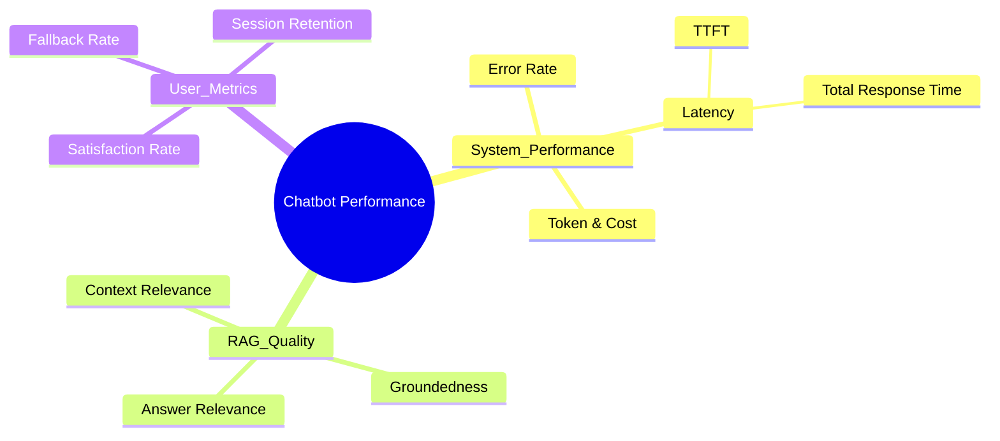
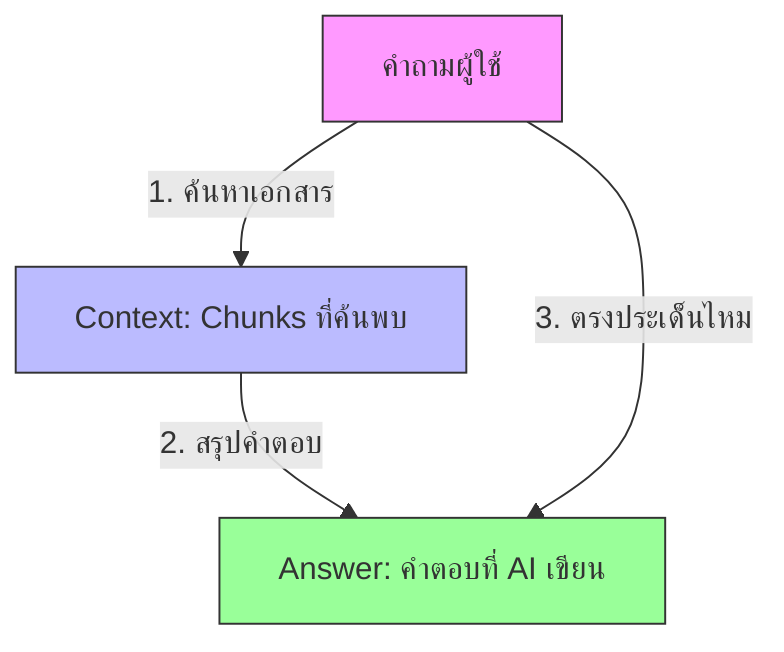
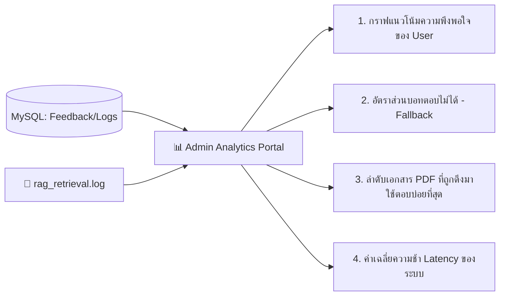

# RAG Chatbot Performance Evaluation & Monitoring

การวัดและประเมินประสิทธิภาพการทำงานของ Chatbot ที่ใช้สถาปัตยกรรม **RAG (Retrieval-Augmented Generation)** จะแตกต่างจากแอปพลิเคชันทั่วไป เนื่องจากเราต้องวัดผลทั้ง **ฝั่งความเร็วระบบ (System Performance)** และ **ฝั่งคุณภาพของคำตอบ (Response Quality)**

เอกสารฉบับนี้สรุปหลักการ ตัววัดผล (Metrics) และเครื่องมือที่ใช้ในการดูและปรับปรุงประสิทธิภาพของ Chatbot

---

## 1. ตัวชี้วัดประสิทธิภาพ 3 ด้านหลัก (The 3 Pillars of Chatbot Metrics)

### ด้านที่ 1: ประสิทธิภาพทางเทคนิค (System Performance)
วัดความเร็วและความเสถียรของระบบ Backend

*   **Latency (ความหน่วงเวลา):**
    *   **TTFT (Time to First Token):** เวลาตั้งแต่ User กดส่งคำถาม จนกระทั่งตัวอักษรแรกเริ่มพิมพ์ตอบกลับมา (ควรต่ำกว่า 1-2 วินาทีหากใช้การ Stream ข้อความ)
    *   **Total Response Time:** เวลาทั้งหมดในการตอบคำถาม 1 ข้อความ (ปกติไม่ควรเกิน 3-5 วินาที)
*   **Throughput & Error Rate:** อัตราการประมวลผลคำถามสำเร็จต่อวินาที และอัตราการเกิด Error (เช่น API Timeout, LLM Limit)
*   **Token & Cost Monitoring:** จำนวน Token ที่ใช้งานต่อคำถาม (เนื่องจากแปรผันตรงกับค่าใช้จ่ายของบริการ LLM/Embedding API)

---

### ด้านที่ 2: คุณภาพของคำตอบ (RAG Quality - The RAG Triad)
วัดความถูกต้องของข้อมูลที่ดึงขึ้นมา และความน่าเชื่อถือของคำตอบที่ AI เจนขึ้นมา โดยใช้หลักการที่เรียกว่า **RAG Triad**

1.  **Context Relevance (ความเกี่ยวข้องของเอกสารที่ค้นเจอ):**
    *   *วัดอะไร:* ระบบค้นหา (Vector DB + Reranker) ดึงข้อมูล Chunks มาได้ตรงประเด็นและครอบคลุมคำถามของ User หรือไม่?
    *   *ปัญหาที่มักเจอ:* ดึงข้อมูลผิดเรื่องมาให้ AI ตอบ ทำให้ AI ตอบเพี้ยน
2.  **Groundedness / Faithfulness (ความซื่อสัตย์ต่อข้อมูลอ้างอิง):**
    *   *วัดอะไร:* คำตอบที่ AI ตอบกลับมานั้น **อ้างอิงจาก Context (ท่อนข้อความ PDF) ที่ดึงมาเท่านั้นจริงหรือไม่** หรือ AI นั่งเทียนเขียนขึ้นมาเอง (Hallucination)?
    *   *ปัญหาที่มักเจอ:* AI ตอบนอกเหนือจากข้อมูลที่อยู่ในเอกสาร PDF ที่ระบุไว้
3.  **Answer Relevance (ความตรงประเด็นของคำตอบ):**
    *   *วัดอะไร:* คำตอบที่ได้ตอบตรงกับคำถามที่ User ถามไปจริงหรือไม่?
    *   *ปัญหาที่มักเจอ:* AI ตอบยืดเยื้อ ตอบคนละเรื่อง หรือไม่ยอมตอบประเด็นสำคัญ

---

### ด้านที่ 3: ความพึงพอใจและพฤติกรรมผู้ใช้ (User Experience Metrics)
วัดว่าระบบทำงานตอบโจทย์ผู้ใช้งานปลายทางจริงๆ หรือไม่ โดยวิเคราะห์จาก Database (`chat_feedback` และ `chat_messages`)

*   **CSAT (Customer Satisfaction Score):** อัตราการกด Like / Dislike หรือคะแนนเฉลี่ย (1-5 ดาว) ที่เก็บได้จากระบบ Feedback
*   **Fallback Rate (อัตราการยอมรับว่าไม่รู้):** สถิติความถี่ที่บอทตอบคำว่า "ขออภัยด้วยครับ ไม่พบข้อมูลในระบบเอกสาร..." ซึ่งบ่งบอกว่าเอกสาร PDF ที่ Admin อัปโหลดเข้ามานั้นยังไม่ครอบคลุมสิ่งที่ผู้ใช้สงสัย
*   **Engagement Rate:** จำนวนข้อความสนทนาเฉลี่ยต่อ 1 Session (หากมีจำนวนมากเกินไป อาจแปลว่าบอทตอบคำถามไม่กระจ่างจนผู้ใช้ต้องถามย้ำๆ)

---

## 2. วิธีการและเครื่องมือประเมินประสิทธิภาพ (Evaluation Methods & Tools)

การดูประสิทธิภาพสามารถทำได้ทั้งแบบ **ดูล็อกแบบเรียลไทม์ (Monitoring)** และแบบ **ทดสอบประเมินคุณภาพ (Evaluation)**

### วิธีที่ 1: การใช้ LLM มาช่วยตรวจข้อสอบ (LLM-as-a-Judge / Automated Eval)
เป็นวิธีที่นิยมที่สุดในปัจจุบันสำหรับการวัดคุณภาพคำตอบ โดยเราจะเขียน Script ให้ LLM รุ่นใหญ่ (เช่น Gemini Pro, GPT-4) ทำหน้าที่เป็น "อาจารย์ผู้ตรวจ" คอยอ่านคำถาม เอกสารอ้างอิง และคำตอบ เพื่อให้คะแนน 0.0 - 1.0 ตามเกณฑ์ RAG Triad

**เครื่องมือที่แนะนำ (Open-source libraries ใน Python):**
1.  **Ragas (Retrieval Augmented Generation Assessment):** เครื่องมือยอดนิยมในการวัดผล RAG โดยเฉพาะ มีฟังก์ชันคำนวณคะแนน Faithfulness, Answer Relevance, Context Recall
2.  **DeepEval / TruLens:** บอร์ดแสดงผลและไลบรารีสำหรับเทสแชทบอทแบบอัตโนมัติก่อนนำระบบขึ้น Production

---

### วิธีที่ 2: การทำ Dashboard สำหรับผู้ดูแลระบบ (Admin Monitoring Dashboard)
ผู้พัฒนาระบบสามารถเขียนหน้าเว็บ Admin ดึงข้อมูลจาก MySQL (`audit_logs`) และ Log File (`rag_retrieval.log`) มาทำหน้ากราฟสรุปสถิติดังนี้:

---

## 3. ขั้นตอนปฏิบัติในการปรับปรุงประสิทธิภาพ Chatbot

หากวัดผลแล้วพบว่าประสิทธิภาพต่ำกว่าเป้าหมาย (เช่น คะแนน RAG ต่ำ หรือความเร็วช้า) Admin สามารถปรับแต่งแก้ไขได้ในจุดต่อไปนี้:

| อาการที่พบ | สาเหตุที่เป็นไปได้ | วิธีแก้ไขปรับปรุง |
| :--- | :--- | :--- |
| **ค้นข้อมูล PDF ไม่เจอ หรือได้ข้อมูลผิดเรื่อง** | • ขนาด Chunk สั้นหรือยาวเกินไป • ข้อมูลใน PDF ไม่มีคีย์เวิร์ดตรงกับที่ User ถาม | • ปรับแต่ง **Chunk Size** และ **Overlap** ใหม่ • เปลี่ยนโมเดล **Embedding** ให้เข้าใจบริบทภาษาไทยดีขึ้น • นำ **Reranker** (เช่น BGE-Reranker) เข้ามาช่วยจัดอันดับใหม่ |
| **AI แนะนำข้อมูลมั่ว (Hallucination)** | • โมเดล LLM พยายามเดาคำตอบเองเมื่อเนื้อหาไม่ครบ | • ปรับ **Prompt System** ให้เข้มงวด เช่น *"ตอบคำถามจากข้อมูลที่กำหนดให้เท่านั้น หากไม่มีให้ตอบว่าไม่พบข้อมูล"* • ปรับค่า **Temperature ของ LLM ให้ต่ำลง** (เช่น 0.0 - 0.2) เพื่อให้เกิดความคงเส้นคงวา |
| **ระบบตอบคำถามช้ามาก (High Latency)** | • ขนาด Context (Chunks) ที่ส่งให้ LLM ใหญ่เกินไป • ไม่ได้ทำ Streaming | • ลดจำนวน Top K Chunks (เช่น ดึงมาแค่ 3 chunks แทนที่จะส่ง 10 chunks) • เปิดใช้งานการ **Stream response** เพื่อให้ตัวอักษรเริ่มแสดงผลทันทีโดยไม่ต้องรอตอบครบจบประโยค |
