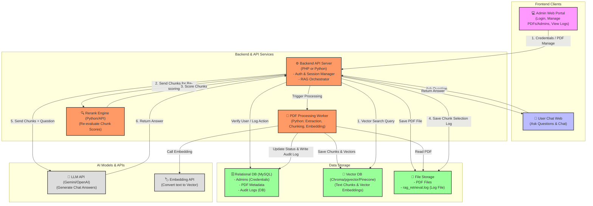
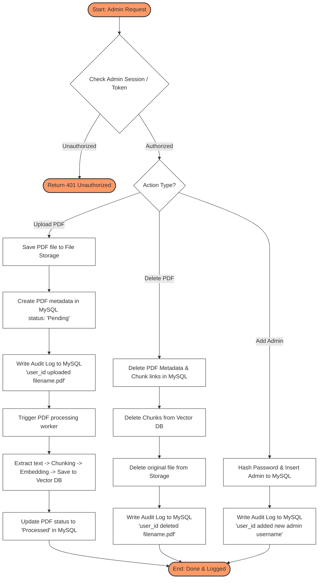
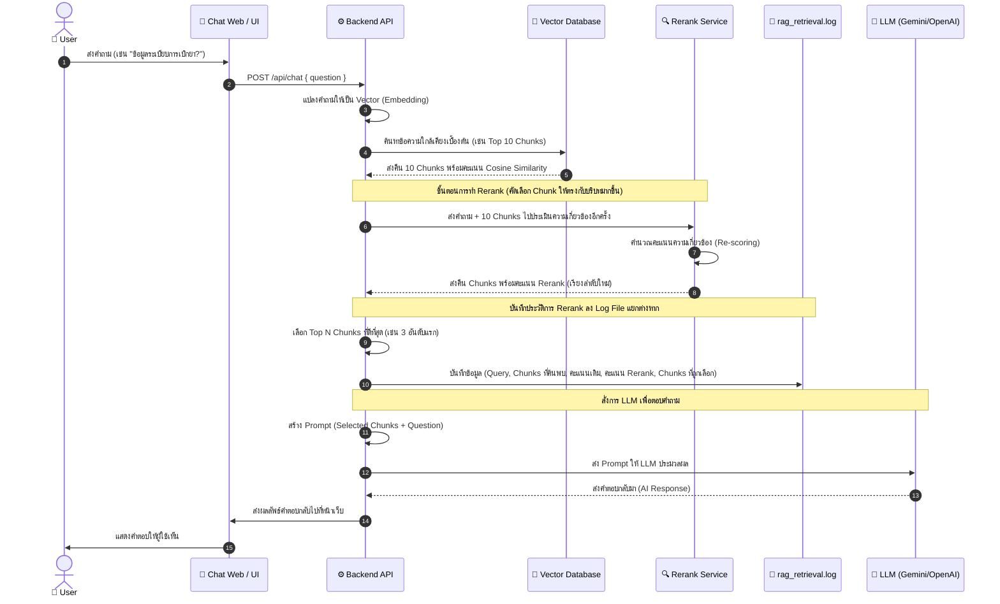

# System Architecture and Diagram Recommendations for PDF RAG System

เอกสารฉบับนี้อธิบายและแนะนำการออกแบบ Diagram สำหรับระบบจัดการเอกสาร PDF, การแบ่งกลุ่มข้อมูล (Chunking), การแปลงเป็นเวกเตอร์ (Embedding) สำหรับผู้ดูแลระบบ (Admin Web) และการสืบค้นข้อมูลในระบบแชทสำหรับผู้ใช้ทั่วไป (Chat Web) พร้อมระบบยืนยันตัวตน (Authentication) ระบบจัดเก็บประวัติการแก้ไข (Audit Logs) และการทำบันทึกข้อมูลการสืบค้นและการทำ Reranking (Query & Chunk Retrieval Logs)

---

## 1. Diagram ที่ควรเขียนสำหรับระบบนี้

เพื่อให้เข้าใจภาพรวมและการทำงานของระบบได้อย่างถูกต้องและครอบคลุม ควรเขียน Diagram 4 แบบหลักๆ ดังนี้:

| ประเภท Diagram | จุดประสงค์ | สิ่งที่แสดงใน Diagram |
| :--- | :--- | :--- |
| **1. System Architecture Diagram** | ภาพรวมสถาปัตยกรรมของทั้งระบบ | การเชื่อมต่อกันระหว่าง Admin Web, Chat Web, API Backend, Databases, Log Files และ AI Services |
| **2. Data Preparation System Diagram** | รายละเอียดการจัดเตรียมข้อมูล (Ingestion Pipeline) | ขั้นตอนตั้งแต่ Admin อัปโหลดไฟล์ PDF -> แปลงเป็น Text -> ทำ Chunking -> แปลงเป็น Vector -> เก็บลง Vector DB พร้อมระบบบันทึก Audit Logs |
| **3. Sequence Diagram (RAG Query & Rerank Flow)** | ขั้นตอนการไหลของข้อมูลเมื่อ User ถามแชท | ลำดับการส่งข้อมูลระหว่าง User -> Chat Web -> Vector Search -> Reranking -> Writing Retrieval Log -> LLM -> การส่งคำตอบกลับ |
| **4. Database Schema Diagram (ER Diagram)** | โครงสร้างการจัดเก็บข้อมูลหลังบ้าน | ตารางจัดการสิทธิ์ (Admin Auth), ข้อมูล PDF, ประวัติการแก้ไข (Audit Logs) |

---

## 2. System Architecture Diagram (สถาปัตยกรรมระบบโดยรวม)

สถาปัตยกรรมระบบนี้แสดงการแยกส่วนระหว่าง **Admin Portal** (ที่มีการยืนยันตัวตนและบันทึกประวัติการกระทำ) และ **Chat Portal** (ที่มีระบบ Reranking คัดเลือกข้อความและบันทึก Log การค้นหาลงไฟล์แยก)



---

## 3. System Diagram การจัดเตรียมข้อมูล (Data Preparation & Admin Logs)

Diagram นี้ครอบคลุมขั้นตอนที่ผู้ดูแลระบบอัปโหลดไฟล์ PDF หรือจัดการเอกสาร และถูกบันทึกประวัติการทำงาน (Audit Logs) ลง MySQL



---

## 4. Sequence Diagram: การประมวลผล RAG + Reranking + Retrieval Logging

เมื่อผู้ใช้ส่งคำถามเข้ามา ระบบจะทำ Vector Search แล้วส่งต่อให้ Reranker คัดกรอง จากนั้นระบบจะสร้าง Log การเลือก Chunk ลงไฟล์ `.log` และส่งเฉพาะ Chunk ที่เหมาะสมให้ LLM



---

## 5. การออกแบบฐานข้อมูล (Database Schema Design)

สำหรับฝั่งระบบจัดการหลังบ้าน (MySQL) แนะนำตารางฐานข้อมูลที่ช่วยรองรับการล็อกอินและการเก็บประวัติการแก้ไข (Audit Logs) ดังนี้:

### 1. ตาราง `admins` (ข้อมูลผู้ดูแลระบบ)
เก็บข้อมูลบัญชีผู้ใช้ระบบหลังบ้าน รหัสผ่านต้องถูกเข้ารหัสด้วยความปลอดภัยสูง (เช่น bcrypt)
```sql
CREATE TABLE admins (
    id INT AUTO_INCREMENT PRIMARY KEY,
    username VARCHAR(50) UNIQUE NOT NULL,
    password_hash VARCHAR(255) NOT NULL,
    fullname VARCHAR(100) NOT NULL,
    role VARCHAR(20) DEFAULT 'admin', -- 'super_admin', 'admin'
    created_at TIMESTAMP DEFAULT CURRENT_TIMESTAMP
);
```

### 2. ตาราง `pdf_files` (ข้อมูลเอกสาร PDF)
เก็บประวัติไฟล์เอกสารที่อัปโหลดเข้าสู่ระบบและสถานะของประมวลผล
```sql
CREATE TABLE pdf_files (
    id INT AUTO_INCREMENT PRIMARY KEY,
    filename VARCHAR(255) NOT NULL,
    file_path VARCHAR(255) NOT NULL,
    status VARCHAR(20) DEFAULT 'Pending', -- 'Pending', 'Processing', 'Processed', 'Failed'
    uploaded_by INT, -- เชื่อมโยงกับ admins.id
    uploaded_at TIMESTAMP DEFAULT CURRENT_TIMESTAMP,
    FOREIGN KEY (uploaded_by) REFERENCES admins(id) ON DELETE SET NULL
);
```

### 3. ตาราง `audit_logs` (เก็บประวัติการแก้ไขข้อมูลของ Admin)
เก็บบันทึกว่า Admin คนไหน ทำอะไร กับข้อมูลส่วนไหน เพื่อใช้ในการตรวจสอบภายหลัง (Audit Trail)
```sql
CREATE TABLE audit_logs (
    id INT AUTO_INCREMENT PRIMARY KEY,
    admin_id INT, -- ผู้ทำรายการ
    action VARCHAR(50) NOT NULL, -- เช่น 'LOGIN', 'UPLOAD_PDF', 'DELETE_PDF', 'ADD_ADMIN'
    target_table VARCHAR(50), -- ตารางที่ถูกแก้ไข (เช่น 'pdf_files', 'admins')
    target_id INT, -- ID ของข้อมูลที่โดนแก้ไข
    details TEXT, -- รายละเอียดเพิ่มเติม (เช่น ชื่อไฟล์ที่อัปโหลด/ลบ หรือข้อมูล JSON เก่า-ใหม่)
    ip_address VARCHAR(45) NOT NULL, -- IP ของผู้ใช้งาน
    created_at TIMESTAMP DEFAULT CURRENT_TIMESTAMP,
    FOREIGN KEY (admin_id) REFERENCES admins(id) ON DELETE SET NULL
);
```

---

## 6. การออกแบบไฟล์บันทึกการทำ Rerank & Chunk Selection (Log File)

เนื่องจากหน้าแชทของระบบอาจมีคำขอจำนวนมาก การเขียน Log การเลือกข้อมูล Chunks และคะแนนความเกี่ยวข้อง (Rerank) ลงไฟล์แยกต่างหาก (เช่น `rag_retrieval.log`) เป็นแนวทางที่ดีกว่าการบันทึกประวัติการสืบค้นลงฐานข้อมูล MySQL ทุกครั้งเพื่อลดภาระการทำงาน (Database Overhead)

### รูปแบบโครงสร้างไฟล์ Log แนะนำ (JSON Lines Format)
แนะนำให้บันทึกเป็นไฟล์รูปแบบ **JSON Lines (.jsonl)** เพราะอ่านง่าย สามารถนำไปเข้าสู่ระบบวิเคราะห์ Log ต่อได้ (เช่น ELK stack, Grafana Loki) และใช้โปรแกรมอื่นๆ เขียนได้รวดเร็ว

**ตัวอย่างข้อมูล 1 บรรทัดในไฟล์ `rag_retrieval.log`:**
```json
{
  "timestamp": "2026-06-19T09:30:15.123+07:00",
  "query_id": "q-9a8b7c6d5e4f",
  "user_question": "ระเบียบการเบิกยาพาราเซตามอลของเจ้าหน้าที่ทำอย่างไร?",
  "retrieved_chunks": [
    {
      "chunk_id": "pdf-12-chunk-4",
      "pdf_name": "ประกาศราคายา_05-06-69.pdf",
      "vector_similarity_score": 0.824,
      "rerank_score": 0.985,
      "selected": true
    },
    {
      "chunk_id": "pdf-12-chunk-5",
      "pdf_name": "ประกาศราคายา_05-06-69.pdf",
      "vector_similarity_score": 0.795,
      "rerank_score": 0.912,
      "selected": true
    },
    {
      "chunk_id": "pdf-5-chunk-12",
      "pdf_name": "สถิติการเบิกเวชภัณฑ์.pdf",
      "vector_similarity_score": 0.741,
      "rerank_score": 0.315,
      "selected": false
    }
  ],
  "llm_model": "gemini-1.5-flash",
  "tokens_used": 1420
}
```

### ทำไมถึงแยก Log การ Rerank ออกมาเป็นไฟล์อื่น?
1. **ประสิทธิภาพ (Performance):** การเขียน Log ลงดิสก์แบบ Append-only ไวกว่าการสั่ง SQL Insert ลง MySQL ทุกครั้งเมื่อมีคนถามแชทบอท
2. **ขนาดข้อมูล (Storage Management):** Log ไฟล์แบบนี้จะมีขนาดใหญ่เร็วมาก การแยกไฟล์ทำให้ระบบสามารถสับเปลี่ยนไฟล์ล็อกได้ง่ายเมื่อขึ้นวันใหม่ (Log Rotation เช่น เก็บแยกตามวัน `rag_retrieval-2026-06-19.log`) และสามารถลบไฟล์เก่าทิ้งได้ง่ายโดยไม่มีผลกระทบกับ MySQL
3. **การวิเคราะห์ (Analysis):** ฝั่ง Admin สามารถเขียน Python Script หรือใช้ Kibana อ่านไฟล์ Log นี้เพื่อเช็คว่าผลลัพธ์การ Rerank แม่นยำหรือไม่ มีจุดไหนที่ Rerank ให้คะแนนเพี้ยน หรือ Chunk ไหนที่ถูกเรียกใช้บ่อยสุด เพื่อประเมินความพึงพอใจและปรับแต่งระบบ

