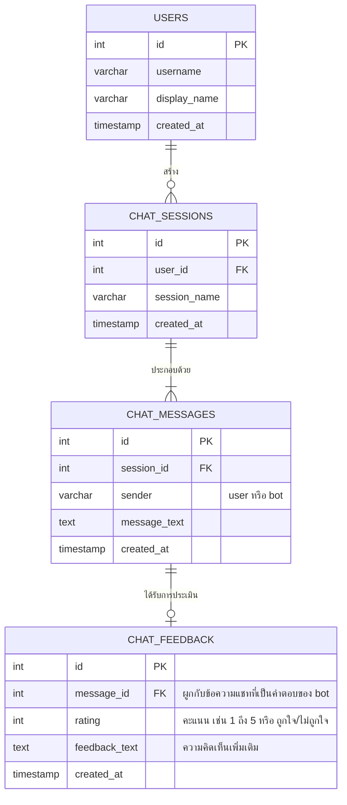

# User Chatbot Portal: Architecture & Database Design

เอกสารฉบับนี้อธิบายรายละเอียดเกี่ยวกับสถาปัตยกรรม แผนภาพความต้องการ (Diagram) และการออกแบบระบบฐานข้อมูล (Database Design) สำหรับฝั่ง **User (ผู้ใช้งานทั่วไปที่เข้ามาคุยกับแชทบอท)** โดยเฉพาะ เพื่ออธิบายว่าฝั่งผู้ใช้ต้องต่อกับฐานข้อมูลอะไรบ้าง เพื่อจุดประสงค์ใด และควรเขียน Diagram แบบไหน

---

## 1. Diagram ที่ควรเขียนสำหรับฝั่ง User (Chatbot Portal)

การเขียนแผนภาพในฝั่งผู้ใช้งานทั่วไป (User Chat) ควรเน้นการอธิบาย **การไหลของคำถาม-คำตอบ (User Journey)** และ **การนำประวัติการสนทนาในอดีต (Chat History) มาป้อนให้ AI** โดยมี Diagram ที่สำคัญ 3 ตัวหลักๆ ดังนี้:

1.  **User Flow / State Diagram:** แสดงการเดินทางของผู้ใช้งานตั้งแต่เปิดหน้าเว็บ -> เลือกห้องแชทเดิมหรือสร้างห้องแชทใหม่ -> พิมพ์คำถาม -> รอคำตอบ -> กดให้คะแนนคำตอบ (Feedback)
2.  **RAG Context Flow (Data Flow Diagram):** แสดงให้เห็นว่าในการถาม 1 ครั้ง ระบบดึงข้อมูลจาก Database สองส่วนมารวมกันอย่างไร (ดึงประวัติการแชทเดิมจาก MySQL + ดึงเนื้อหา PDF ที่ใกล้เคียงจาก Vector DB) ก่อนส่งให้ LLM
3.  **Database ER Diagram (ฝั่ง Chat & Session):** แสดงความสัมพันธ์ของตารางที่ใช้เก็บห้องแชท ข้อความ และคะแนนการประเมิน

---

## 2. ฝั่ง User ใช้ Database อะไร? และใช้เพื่ออะไร?

ฝั่งเว็บแชทที่ผู้ใช้ถามจำเป็นต้องใช้งานฐานข้อมูล **2 ประเภทหลัก** ทำงานร่วมกันดังนี้:

| ประเภทฐานข้อมูล | เทคโนโลยีที่แนะนำ | เพื่ออะไร? (Purpose) | ข้อมูลที่จัดเก็บ |
| :--- | :--- | :--- | :--- |
| **1. Relational DB (SQL)** | MySQL / PostgreSQL | เพื่อเก็บโครงสร้างข้อมูลทั่วไป, บัญชีผู้ใช้, **ประวัติการแชท**, และ**การประเมินความพึงพอใจ** ของบอท | • ข้อมูลผู้ใช้งาน (User Accounts)<br>• ห้องสนทนา (Chat Sessions)<br>• ข้อความแชทโต้ตอบ (Chat Messages)<br>• คะแนนคำตอบ (Chat Feedback) |
| **2. Vector Database (NoSQL)** | ChromaDB / pgvector / Pinecone | เพื่อใช้ในการ**ค้นหาข้อมูลตามความหมาย (Semantic Search)** จากไฟล์ PDF ที่ Admin จัดเตรียมไว้ | • ข้อความย่อย (Text Chunks) จาก PDF<br>• ค่าเวกเตอร์ (Vector Embeddings) ขนาดใหญ่ |
| **3. Cache Database (Optional)** | Redis | เพื่อใช้ทำ **Session Memory** ทำให้การดึงประวัติการแชทล่าสุดของ User ไปป้อนให้ LLM ทำได้เร็วที่สุด | • ข้อมูลข้อความแชท 3-5 ล่าสุด เพื่อส่งเป็นบริบท (Context Memory) ให้ AI |

---

## 3. RAG Context Flow (แผนภาพการไหลของข้อมูลเมื่อ User ถามคำถาม)

แผนภาพนี้จะช่วยอธิบายว่าทำไมฝั่ง User ถึงต้องเชื่อมต่อกับทั้ง **MySQL (เก็บประวัติแชท)** และ **Vector DB (เก็บเนื้อหา PDF)** ในเวลาเดียวกัน

```mermaid
flowchart TD
    %% Define Styles
    classDef client fill:#bbf,stroke:#333,stroke-width:2px;
    classDef api fill:#f96,stroke:#333,stroke-width:2px;
    classDef sqldb fill:#9f9,stroke:#333,stroke-width:2px;
    classDef vectordb fill:#f9f,stroke:#333,stroke-width:2px;
    classDef external fill:#ddd,stroke:#333,stroke-width:2px;

    User([👤 Userพิมพ์คำถาม]):::client --> ChatWeb[💬 Chat Web Interface]:::client
    
    ChatWeb -->|1. ส่งคำถาม & Session ID| API[⚙️ Chatbot API Server]:::api
    
    %% Fetching History & Context
    API -->|2. ดึงประวัติแชท 5 ครั้งล่าสุด| MySQL[(🗄️ MySQL: Chat History)]:::sqldb
    MySQL -->>|ส่งประวัติสนทนากลับ| API
    
    API -->|3. ค้นหาเอกสาร PDF ที่เกี่ยวข้อง| VectorDB[(🧬 Vector DB: PDF Chunks)]:::vectordb
    VectorDB -->>|ส่ง Text Chunks กลับ| API
    
    %% Building Prompt & LLM
    API -->|4. ประกอบร่างเป็น Prompt<br>History + Context + Question| LLM[\🤖 LLM API: Gemini/OpenAI/]::external
    LLM -->>|5. ตอบกลับ AI Response| API
    
    %% Saving & Returning
    API -->|6. บันทึกคำถามและคำตอบใหม่ลง DB| MySQL
    API -->|7. ส่งคำตอบกลับ| ChatWeb
    ChatWeb --> User
```

---

## 4. โครงสร้างฐานข้อมูลสำหรับฝั่ง User (Database Schema Design)

ในการเก็บประวัติการแชท (Chat History) และความพึงพอใจการตอบคำถามของระบบ (Feedback) สามารถออกแบบฐานข้อมูลเชิงสัมพันธ์ (Relational Database) ได้ดังนี้



### คำอธิบายโครงสร้างตาราง (Table Details)

1.  **ตาราง `users`:**
    *   *ประโยชน์:* เก็บข้อมูลผู้ใช้งานทั่วไปที่เข้ามาถามคำถาม (ถ้าเป็นเว็บที่เปิดให้เข้าใช้โดยตรงแบบไม่ต้อง Login อาจจะใช้รหัส Session/IP Address หรือ Anonymous ID แทนก็ได้)
2.  **ตาราง `chat_sessions`:**
    *   *ประโยชน์:* เก็บหัวข้อประเด็นการคุย เช่น ผู้ใช้สามารถเปิด "ห้องแชทใหม่" แยกเรื่องกันคุยได้ เหมือนกับหน้าต่างคุยของ ChatGPT/Gemini
3.  **ตาราง `chat_messages`:**
    *   *ประโยชน์:* เก็บทุกข้อความที่มีการโต้ตอบกันระหว่างผู้ใช้ (`user`) และบอท (`bot`) ข้อมูลตัวนี้จำเป็นมากเนื่องจาก **LLM ไม่มีหน่วยความจำในตัวเอง** ระบบจำเป็นต้องดึงข้อมูลนี้ 3-5 ข้อความล่าสุดส่งไปให้ LLM ทุกครั้งเพื่อให้ AI เข้าใจว่าก่อนหน้านี้กำลังคุยเรื่องอะไรกันอยู่
4.  **ตาราง `chat_feedback`:**
    *   *ประโยชน์:* ให้ผู้ใช้สามารถกดถูกใจ (Like) / ไม่ถูกใจ (Dislike) หรือให้คะแนนดาว พร้อมเขียนคอมเมนต์สั้นๆ ต่อข้อความที่ AI ตอบมา ข้อมูลนี้สำคัญอย่างยิ่งกับฝั่ง Admin ในการนำไปตรวจสอบ ปรับเปลี่ยนเกณฑ์ Reranking หรือจัดเตรียมไฟล์ PDF ชุดใหม่เพื่อปรับปรุงระบบให้ฉลาดขึ้น

---

## 5. สรุปความต้องการระบบฐานข้อมูลฝั่ง User

หากต้องการเขียนเสนอแนวคิดการออกแบบระบบแชทบอทนี้ให้สมบูรณ์ แนะนำให้ระบุการใช้ประโยชน์ของฐานข้อมูลดังสรุปนี้:

1.  **MySQL/PostgreSQL** ทำหน้าที่รักษา **สถานะผู้ใช้ (State) และบริบทการคุย (Memory)**
2.  **Vector DB** ทำหน้าที่เป็น **สมอง/แหล่งข้อมูลความรู้ (Knowledge Base)** ที่ระบบใช้ค้นหาเนื้อหาอ้างอิงจาก PDF
3.  **Log File (`rag_retrieval.log`)** ทำหน้าที่บันทึก **ประสิทธิภาพและความถูกต้อง (Quality & Monitoring)** ในการเลือกข้อมูลของระบบ Rerank ซึ่งจะเชื่อมโยงระหว่างการเลือก Chunk ใน Vector DB และผลลัพธ์ที่ User ได้รับ
